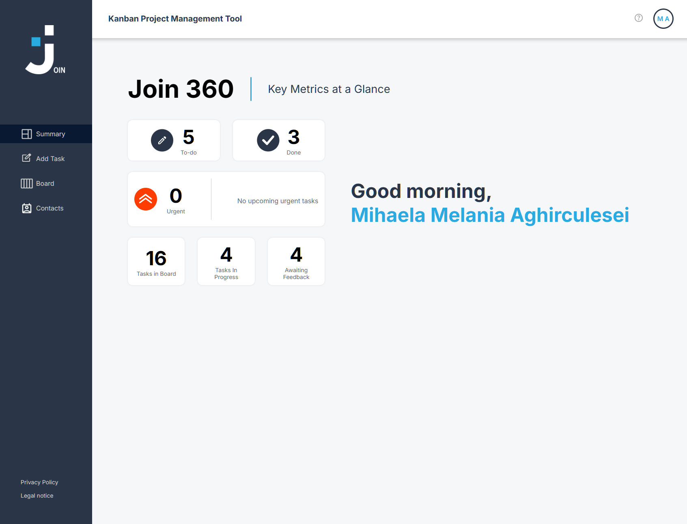
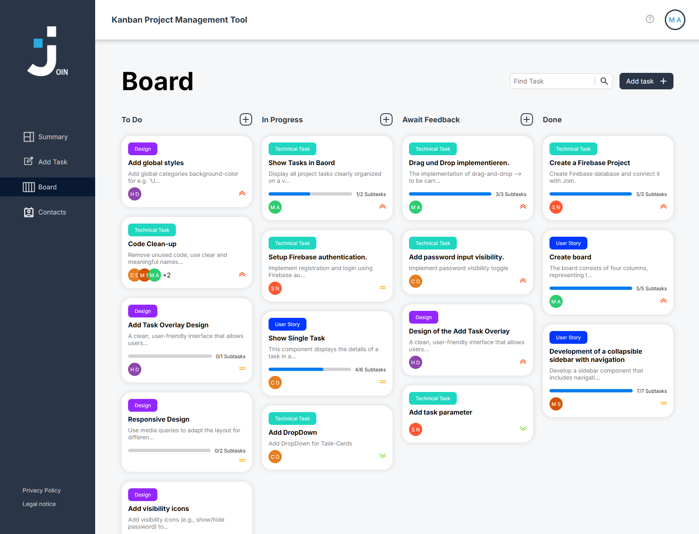
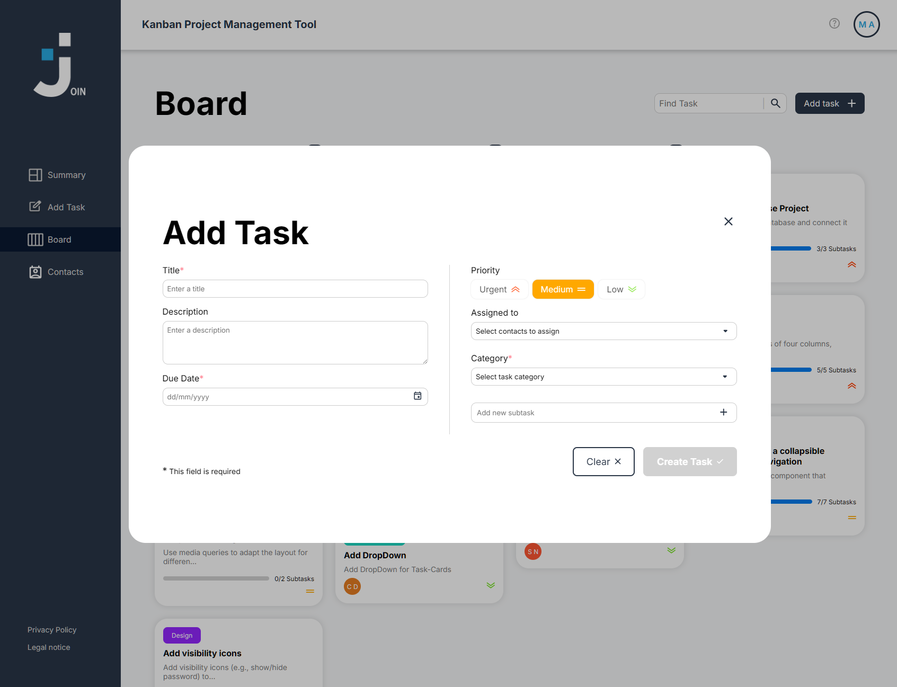
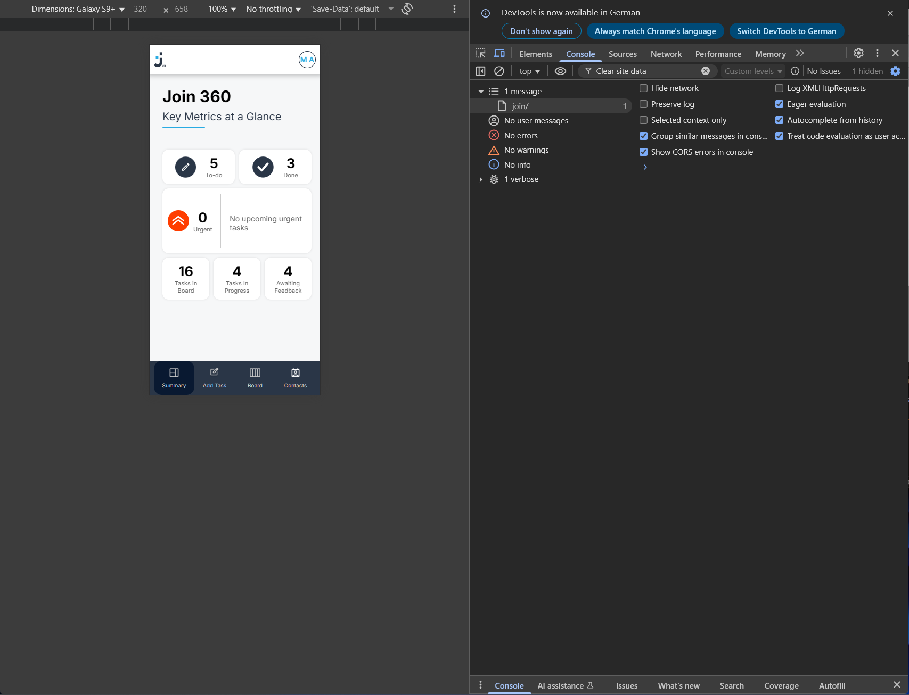
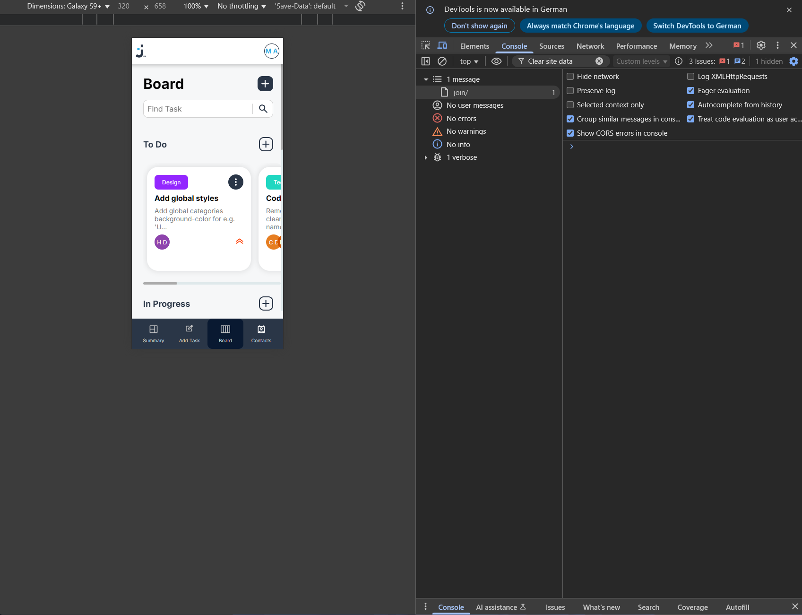
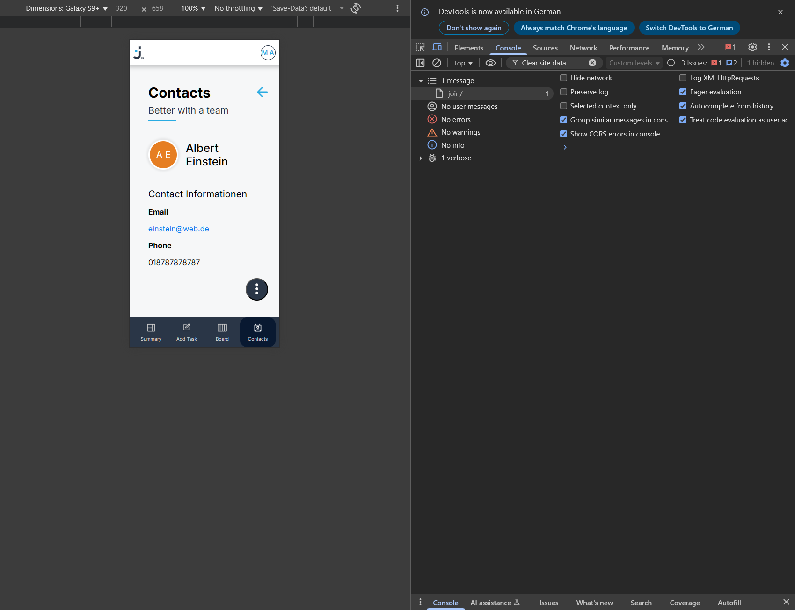

# Join – Kanban Project Management

<div align="center">


**A Kanban board for planning tasks and contacts, built with Angular and Firebase.**

[](https://join-aghirculesei.pages.dev)
[](https://github.com/MihaelaAghirculesei/join-kanban-board/actions/workflows/ci.yml)
[](https://angular.dev/)
[](https://firebase.google.com/)
[](https://www.typescriptlang.org/)

[Overview](#overview) • [Features](#features) • [Tech stack](#tech-stack) • [Getting started](#getting-started) • [Team](#team--origin) • [My contributions](#what-i-improved-after-the-team-phase)

</div>

---

## Overview

**Join** is a Kanban-style task manager. Users sign up (or use the guest login), manage
contacts, create tasks with priority, due date, assignees and subtasks, and move them across
the board with drag and drop. All data is stored in Cloud Firestore and synchronised in real time.

> Join started as a five-person team project at the Developer Akademie (see [Team & origin](#team--origin)).
> This repository is my fork, which I maintain and continue to develop on my own.

## Features

- **Authentication** – sign up, login with email and password, guest login (Firebase Authentication)
- **Protected routes** – app pages require a signed-in user (functional route guard)
- **Summary dashboard** – counts per column, urgent tasks and the next urgent deadline
- **Kanban board** – four columns (To do, In progress, Await feedback, Done), drag and drop on
  desktop, move menu on mobile, live search
- **Tasks** – title, description, due date, priority (Urgent / Medium / Low), category,
  assignees and subtasks with a progress bar
- **Contacts** – create, edit and delete contacts with generated initials and colours
- **Real-time sync** – Firestore snapshot listeners keep every open tab up to date
- **Responsive layout** – desktop, tablet and mobile
- **Legal pages** – legal notice, privacy policy and help page

## Tech stack

| Area | Technology |
|------|------------|
| Framework | Angular 22 (standalone components, signals, new control flow, lazy-loaded routes) |
| Language | TypeScript (strict mode, strict templates) |
| Backend | Firebase Authentication and Cloud Firestore via the official Firebase JS SDK (small DI wrapper in `src/app/firebase.ts`) |
| UI | SCSS (Sass modules), self-hosted Inter font, Angular CDK drag and drop |
| Testing | Karma + Jasmine; Firestore security rules tested on the Firebase emulator |
| CI | GitHub Actions (build, unit tests, security rules tests, weekly health check), CodeQL; Dependabot for dependency updates |
| Hosting | Cloudflare Pages |

## Getting started

Requirements: Node.js 22.22.3+ (see `.node-version`) and npm.

```bash
git clone https://github.com/MihaelaAghirculesei/join-kanban-board.git
cd join-kanban-board
npm ci
npm start            # http://localhost:4200
```

> Use port 4200 for local development: the Firebase API key only accepts `localhost:4200` besides the deployed domains.

### Scripts

| Command | Description |
|---------|-------------|
| `npm start` | Development server with live reload |
| `npm run build` | Production build into `dist/project/browser` |
| `npm run watch` | Development build in watch mode |
| `npm test` | Unit tests (Karma, add `-- --watch=false --browsers=ChromeHeadless` for a single run) |

### Firebase configuration

The Firebase web config lives in `src/app/app.config.ts`. A Firebase web API key is not a secret –
it only identifies the project. Access is protected by:

- **Firestore security rules** – versioned in [`firestore.rules`](./firestore.rules): only signed-in users can read or write tasks and contacts, and every user can only access their own profile
- **API key restrictions** in the Google Cloud console: HTTP referrers limited to the deployed domains and `localhost:4200`, and only the APIs Firebase needs (Identity Toolkit, Token Service, Cloud Firestore)

Deploy the rules with the Firebase CLI (`firebase deploy --only firestore:rules`) or paste them into the Firebase console.
The rules are covered by tests that run against the Firestore emulator (Java required):

```bash
cd firestore-tests
npm ci
npm test
```

Unit tests never talk to this project: they use an isolated `demo-` Firebase app with networking
disabled (`src/testing/test-providers.ts`).

## Project structure

```
src/app
├── firebase.ts        # Firebase providers (app, Auth, Firestore) and authState()
├── guards/            # authGuard (route protection)
├── interfaces/        # Task, Contact, Userdata
├── landingpage/       # login, sign-up
├── main-content/      # summary, board, add-task, task detail, contacts
├── services/          # auth, tasks, contacts, overlays, feedback, date input
├── shared/components/ # header (+ help, legal notice, privacy), sidebar, footer
└── styles/            # variables, mixins, buttons, fonts
src/testing/           # shared providers for unit tests
firestore.rules        # Firestore security rules
firestore-tests/       # security rules tests (Firestore emulator)
```

## Screenshots

| Dashboard | Kanban board | Task details |
|-----------|--------------|--------------|
|  |  |  |

| Mobile dashboard | Mobile board | Contacts |
|------------------|--------------|----------|
|  |  |  |

## Team & origin

Join was built in spring 2025 as a team project during the web development bootcamp at the
[Developer Akademie](https://developerakademie.com/). The design belongs to the Developer Akademie.

**Team:** Christian Duus, Ha Dao, Mihaela Melania Aghirculesei, Soufiane Nouira, Marvin Schneemann

- Original team repository: [Soufianenouira/join](https://github.com/Soufianenouira/join)
- The final state of the team phase is tagged as [`team-final`](https://github.com/MihaelaAghirculesei/join-kanban-board/tree/team-final) in this repository.

My main areas during the team phase: header and user menu, help page, legal notice and privacy
policy, the board view with task cards and subtask progress bar, and the structure and styling
of the login and sign-up pages.

## What I improved after the team phase

- **Security** – route guard for app pages; Firestore security rules with 17 emulator tests in CI; data is only loaded after login; Firebase API key restricted by domain and API
- **Upgrade** – Angular 17 → 22, TypeScript 6.0, `@angular/build`, Node.js 22 – one major version at a time with the official migrations; AngularFire replaced by the official Firebase SDK, so Angular upgrades no longer wait for AngularFire releases
- **Dependencies** – npm audit from 97 findings to 0, unused packages removed, Dependabot for ongoing updates; firebase 12 deliberately postponed because it adds 205 kB to the initial bundle ([firebase-js-sdk#10424](https://github.com/firebase/firebase-js-sdk/issues/10424))
- **Testing** – repaired the test suite (it did not compile and most specs lacked providers) with shared, network-free test providers; tests for the route guard and the Firebase providers
- **CI** – GitHub Actions for build, unit tests and security rules tests on every pull request, CodeQL code scanning, a protected `master` branch (pull requests with green checks only) and a weekly health check (audit, build, live site, Angular end of support)
- **Performance** – lazy-loaded pages and no AngularFire (initial bundle 1.13 MB → 0.90 MB), removed an unused Angular
  Material theme (global CSS 93 kB → 9 kB) and unused Google Fonts requests
- **Privacy** – no more requests to Google Fonts, complete privacy policy and legal notice for this deployment
- **Accessibility** – keyboard-accessible user menu with proper ARIA attributes; autocomplete hints on the login and sign-up forms for password managers
- **Code quality** – removed dead code and debug output, fixed naming, null-safe task details, realistic build budgets, Sass module system instead of the deprecated `@import`, no more duplicated global styles in components
- **Deployment** – moved to Cloudflare Pages served from the domain root

## Contact

**Mihaela Melania Aghirculesei**

[](https://aghirculesei.pages.dev/)
[](https://www.linkedin.com/in/mihaela-aghirculesei-84147a23b/)
[](https://github.com/MihaelaAghirculesei)
[](mailto:aghirculesei@gmail.com)
