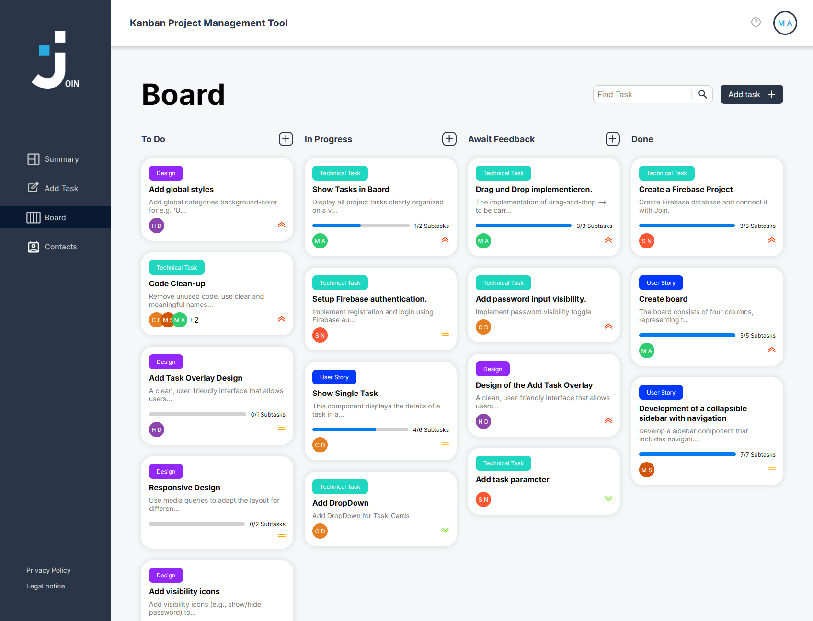

# 🚀 Join - Advanced Project Management Kanban Board

<div align="center">


**A modern, collaborative project management and task organization platform built with Angular and Firebase**

[](https://mihaela-melania-aghirculesei.de/join/)
[](https://angular.io/)
[](https://firebase.google.com/)
[](https://www.typescriptlang.org/)

[🎯 Project Overview](#-project-overview) • [✨ Features](#-features) • [🛠️ Tech Stack](#️-tech-stack) • [🚀 Installation](#-installation) • [📖 Usage](#-usage)

</div>

---

## 🎯 **Project Overview**

**Join** is a comprehensive project management platform designed to streamline team collaboration and task organization. Built with cutting-edge Angular 17 and Firebase integration, it offers real-time synchronization, intuitive Kanban boards, and powerful project management tools that scale with your team's needs.

### 🌟 **What Makes This Special**

- **⚡ Real-Time Collaboration** - Instant updates across all team members
- **🔥 Firebase Integration** - Scalable cloud backend with real-time database
- **📱 Responsive Design** - Perfect experience on desktop, tablet, and mobile
- **🎨 Modern Angular 17** - Latest features with standalone components
- **🔐 Secure Authentication** - Firebase Auth with role-based access control
- **🏗️ Enterprise Architecture** - Scalable, maintainable, and testable codebase

---

## ✨ **Features**

<table>
<tr>
<td width="50%">

### 🎯 **Core Features**
- ✅ **Kanban Board System** - Intuitive drag-and-drop task management
- ✅ **Real-Time Sync** - Instant updates across all devices
- ✅ **Team Collaboration** - Multi-user project sharing
- ✅ **Task Management** - Detailed task creation and tracking
- ✅ **Contact Management** - Team member profiles and assignment
- ✅ **Dashboard Analytics** - Project overview and statistics
- ✅ **Priority Management** - Color-coded task prioritization

</td>
<td width="50%">

### 🔧 **Advanced Features**
- ✅ **Firebase Authentication** - Secure user management
- ✅ **Cloud Storage** - Persistent data with automatic backup
- ✅ **Responsive UI** - Optimized for all screen sizes
- ✅ **PWA Ready** - Progressive Web App capabilities
- ✅ **Dark/Light Theme** - Customizable user experience
- ✅ **Search & Filter** - Quick task and project discovery
- ✅ **Legal Compliance** - Privacy policy and legal notices

</td>
</tr>
</table>

---

## 🛠️ **Tech Stack**

<div align="center">

| Frontend | Backend & Database | Development Tools | Deployment |
|----------|-------------------|-------------------|------------|
|  |  |  |  |
|  |  |  |  |
|  |  |  |  |

</div>

---

## 🚀 **Installation**

### 🔥 **Quick Start**

```bash
# Clone the repository
git clone https://github.com/Soufianenouira/join.git

# Navigate to project directory
cd join

# Install dependencies
npm install

# Start development server
npm start
# Open http://localhost:4200 in your browser
```

### 🔐 **Security & Environment Setup**

> ⚠️ **Current State**: Firebase configuration is currently hard-coded in `app.config.ts`. This is acceptable for development but should be improved for production.

#### **Current Configuration Structure**

```typescript
// Current setup in app.config.ts (development only)
export const appConfig: ApplicationConfig = {
  providers: [
    provideFirebaseApp(() => initializeApp({
      // Configuration details removed for security
      // See Firebase Console for actual credentials
      apiKey: "your-api-key",
      authDomain: "your-domain.firebaseapp.com",
      // ... other config
    }))
  ]
};
```

#### **Recommended Production Setup**

For production deployment, consider moving to environment variables:

```typescript
// Future improvement: src/environments/environment.ts
export const environment = {
  production: false,
  firebase: {
    apiKey: process.env['FIREBASE_API_KEY'],
    // ... other config from environment variables
  }
};
```

#### **Firestore Security Rules**

```javascript
rules_version = '2';
service cloud.firestore {
  match /databases/{database}/documents {
    // Tasks can be read and written by authenticated users
    match /tasks/{taskId} {
      allow read, write: if request.auth != null;
    }
    
    // Contacts can be read and written by authenticated users
    match /contacts/{contactId} {
      allow read, write: if request.auth != null;
    }
    
    // Users can only access their own user document
    match /users/{userId} {
      allow read, write: if request.auth != null && request.auth.uid == userId;
    }
  }
}
```

### 📦 **Development Scripts**

```bash
# Start development server
npm start

# Build for production
npm run build

# Build and watch for changes
npm run watch

# Run unit tests
npm test

# Angular CLI commands
ng generate component your-component-name
ng generate service your-service-name
```

---

## 🧪 **Demo & Testing**

### 🎮 **Try the Live Demo**
**Live URL**: [https://mihaela-melania-aghirculesei.de/join/](https://mihaela-melania-aghirculesei.de/join/)

**Getting Started:**
- Create your own account to experience all features
- Test the drag & drop Kanban functionality
- Explore real-time collaboration features
- Try the responsive design on different devices

> 💡 **Tip**: Open the app in multiple browser tabs to see real-time synchronization in action!

### 🧪 **Testing Features**
- ✅ **User Registration & Authentication**
- ✅ **Task Creation & Management**
- ✅ **Contact Management System**
- ✅ **Kanban Board Drag & Drop**
- ✅ **Real-time Data Synchronization**
- ✅ **Responsive Design (Desktop/Tablet/Mobile)**

---

## ⚡ **Performance Metrics**

### 🚀 **Application Performance**
- 📦 **Bundle Size**: Optimized for fast loading (< 2MB gzipped)
- 🔄 **Real-time Updates**: Firebase Firestore provides instant synchronization
- 📱 **Mobile First**: 100% responsive design across all devices
- ⚡ **Loading Speed**: Lazy loading modules for optimal performance
- 🎯 **Lighthouse Ready**: Optimized for Core Web Vitals

### 🛡️ **Reliability & Security**
- 🔐 **Firebase Authentication**: Enterprise-grade security
- 🔄 **Real-time Sync**: Automatic data backup and synchronization
- 📱 **PWA Ready**: Offline capability and app-like experience
- 🧪 **Testing**: Unit tests with Karma & Jasmine

### 🌐 **Browser Compatibility**

| Browser | Version | Support Level |
|---------|---------|---------------|
| Chrome | 90+ | ✅ Full Support |
| Firefox | 88+ | ✅ Full Support |
| Safari | 14+ | ✅ Full Support |
| Edge | 90+ | ✅ Full Support |
| Mobile Safari | iOS 14+ | ✅ Full Support |
| Chrome Mobile | Android 90+ | ✅ Full Support |

---

## 📸 **Project Screenshots**

### 🖥️ **Desktop Experience**

<div align="center">

| Dashboard | Kanban Board | Task Management |
|-----------|--------------|-----------------|
|  |  |  |

</div>

### 📱 **Mobile Experience**

<div align="center">

| Mobile Dashboard | Mobile Kanban | Contact Management |
|------------------|---------------|-------------------|
|  |  |  |

</div>

### 📋 **Additional Views**

<div align="center">

| Mobile Task Management |
|------------------------|
|  |

</div>

---

## 🔥 **Firebase Integration**

### 🗃️ **Database Structure (Current Implementation)**

Based on the actual code implementation:

```typescript
// Firestore Collections - REAL STRUCTURE
interface Task {
  id: string;
  title: string;
  description: string;
  date: string;  // ISO date string format
  priority: 'Urgent' | 'Medium' | 'Low' | '';  // String priority levels
  assignedTo?: Contact[];  // Array of Contact objects
  category: string;  // Free-form category string
  subtasks: { title: string; isDone: boolean }[];  // Simple subtask structure
  status: string;  // Generic status string
  dropDownOpen: boolean;  // UI state flag
}

interface Contact {
  id?: string;  // Optional ID (generated on save)
  name: string;
  email: string;
  phone: string;  // Required phone field
  color?: string;  // Optional color assignment
  letters: string;  // Generated initials (not 'initials')
  selected: boolean;  // Selection state for UI
}

interface User {
  uid: string;
  email: string;
  username?: string;  // Optional username field
  name?: string;
  createdAt?: string;
}
```

### 🔐 **Authentication Flow (Firebase v10+)**

```typescript
// Authentication Service - SIMPLIFIED IMPLEMENTATION (matches actual code)
import { Injectable } from '@angular/core';
import { Auth, signInWithEmailAndPassword, createUserWithEmailAndPassword, signOut } from '@angular/fire/auth';
import { Firestore, doc, setDoc } from '@angular/fire/firestore';
import { Router } from '@angular/router';

@Injectable({
  providedIn: 'root'
})
export class AuthService {
  constructor(
    private auth: Auth,
    private firestore: Firestore,
    private router: Router
  ) {}

  async signIn(email: string, password: string) {
    return await signInWithEmailAndPassword(this.auth, email, password);
  }

  async signUp(email: string, password: string) {
    return await createUserWithEmailAndPassword(this.auth, email, password);
  }

  async signOut(): Promise<void> {
    await signOut(this.auth);
    this.router.navigate(['/login']);
  }
}
```

---

## 📖 **Usage**

### 🚀 **Getting Started**

1. **🌐 Landing Page**: Welcome page with project overview
2. **📝 Sign Up**: Create your account with email/password
3. **🔐 Login**: Access your workspace
4. **📊 Summary Dashboard**: View project overview and statistics
5. **🎯 Start Managing**: Create tasks, contacts, and organize your workflow

### 🔑 **Core Features**

| Feature | Description | Location |
|---------|-------------|----------|
| **📋 Task Management** | Create, edit, and track tasks | Board & Add Task |
| **👥 Contact Management** | Manage team members and contacts | Contact List |
| **📊 Kanban Board** | Visual task organization with drag & drop | Board |
| **📈 Dashboard** | Project summary and analytics | Summary |
| **🔐 Authentication** | Secure login/signup system | Login/Signup |
| **📱 Responsive Design** | Works on desktop, tablet, and mobile | All Pages |

### 🎯 **Key Workflows**

#### **Creating a New Task**
1. Click "Add Task" in the main navigation
2. Fill required fields:
   - Task title and description
   - Select assignee from contacts
   - Choose priority level (Urgent/Medium/Low)
   - Set due date
3. Assign to board column (To Do/In Progress/Await Feedback/Done)
4. Click "Create Task" - instantly appears on Kanban board
5. All team members see the update in real-time

#### **Managing the Kanban Board**
1. View four main columns: To Do → In Progress → Await Feedback → Done
2. Drag & drop tasks between columns to update status
3. Click on any task card to open detailed view
4. Edit task properties directly from the board
5. Use search function to quickly find specific tasks
6. Filter by assignee, priority, or due date

#### **Contact Management**
1. Navigate to "Contacts" section
2. Add team members with name, email, and phone
3. System automatically generates initials and assigns colors
4. Use contacts when creating/assigning tasks
5. View contact activity and task assignments

### 📱 **Navigation Structure**

```
├── 🏠 Landing Page (Welcome)
├── 🔐 Authentication (Login/Signup)
├── 📊 Main Content
│   ├── 📈 Summary Dashboard
│   ├── 📋 Kanban Board
│   ├── ➕ Add Task
│   ├── 👥 Contacts
│   │   ├── 📝 Add Contact
│   │   ├── 📋 Contact List
│   │   └── 👤 Single Contact View
├── ❓ Help & Support
├── ⚖️ Legal Notice
└── 🔒 Privacy Policy
```

---

## 🎨 **UI/UX Features**

### 🎭 **Theme Customization**

```scss
// Custom SCSS Variables
:root {
  --primary-color: #1976d2;
  --secondary-color: #424242;
  --accent-color: #ff4081;
  --background-color: #fafafa;
  --surface-color: #ffffff;
  --text-primary: #212121;
  --text-secondary: #757575;
}

[data-theme="dark"] {
  --background-color: #121212;
  --surface-color: #1e1e1e;
  --text-primary: #ffffff;
  --text-secondary: #aaaaaa;
}
```

### 🎯 **Component Structure**

```typescript
// Shared Components
├── HeaderComponent      # Navigation and user menu
├── SidebarComponent    # Main navigation menu
├── FooterComponent     # App footer information

// Feature Components
├── SummaryComponent    # Dashboard overview
├── AddTaskComponent    # Task creation form
├── BoardComponent      # Kanban board display
├── ContactsComponent   # Contact management
└── TaskComponent       # Task detail view
```

### 🎯 **Angular Material Integration**

```typescript
// Material Modules
import { MatToolbarModule } from '@angular/material/toolbar';
import { MatCardModule } from '@angular/material/card';
import { MatButtonModule } from '@angular/material/button';
import { MatDialogModule } from '@angular/material/dialog';
import { DragDropModule } from '@angular/cdk/drag-drop';
```

---

## 🛠️ **Troubleshooting & FAQ**

### 🚨 **Common Issues & Solutions**

#### **Installation Issues**
```bash
# Issue: npm install fails
# Solution: Clear cache and reinstall
npm cache clean --force
rm -rf node_modules package-lock.json
npm install

# Issue: Angular CLI version conflicts
# Solution: Update to latest version
npm uninstall -g @angular/cli
npm install -g @angular/cli@latest
```

#### **Firebase Connection Issues**
```typescript
// Issue: Firebase configuration errors
// Solution: Verify environment configuration
// Check that all Firebase credentials are correctly set in app.config.ts

// Issue: Firestore security rules blocking access
// Solution: Update security rules (see Security section above)
```

#### **Build & Deployment Issues**
```bash
# Issue: Build fails in production
# Solution: Build with production flag
ng build --configuration production

# Issue: Firebase deployment fails
# Solution: Login and initialize Firebase
firebase login
firebase init
firebase deploy
```

### ❓ **Frequently Asked Questions**

#### **Q: How do I add new team members?**
A: Navigate to Contacts section → Add Contact → Fill in name, email, and phone → Save. The contact will be available for task assignment.

#### **Q: Can I use this offline?**
A: The app has basic PWA capabilities, but requires internet connection for real-time synchronization and Firebase services.

#### **Q: How do I change task status?**
A: Simply drag and drop tasks between columns on the Kanban board, or click on a task to edit its details.

#### **Q: Is my data secure?**
A: Yes, all data is stored in Firebase with authentication required. See the Security section for implementation details.

#### **Q: Can I export my data?**
A: Data export functionality is planned for future releases. Currently, data is accessible through the Firebase console.

### 📞 **Support**
- **Issues**: [GitHub Issues](https://github.com/Soufianenouira/join/issues)
- **Email**: [kontakt@mihaela-melania-aghirculesei.de](mailto:kontakt@mihaela-melania-aghirculesei.de)
- **Documentation**: This README and inline code comments

---

## 🚀 **Deployment**

### 🔥 **Firebase Hosting**

```bash
# Build for production
ng build --configuration production

# Deploy to Firebase
firebase deploy

# Deploy with custom message
firebase deploy -m "Version 1.2.0 release"
```

### 🌐 **Firebase Setup**

```bash
# Install Firebase CLI
npm install -g firebase-tools

# Login to Firebase
firebase login

# Initialize Firebase in your project
firebase init

# Deploy to Firebase Hosting
npm run build
firebase deploy
```

---

## 📋 **Roadmap**

<div align="center">

### 🎯 **Planned Features**

| Phase | Features | Status |
|-------|----------|--------|
| **Phase 1** | 📊 Advanced Analytics Dashboard | 📅 Planned |
| **Phase 2** | 📱 Mobile App (Ionic) | 📅 Planned |
| **Phase 3** | 🔌 Third-party Integrations | 📅 Planned |
| **Phase 4** | 🤖 AI Task Suggestions | 💡 Concept |
| **Phase 5** | 📈 Team Performance Reports | 💡 Concept |

</div>

### 🎯 **Feature Details**

- [ ] 📊 **Enhanced Analytics** - Team productivity insights and project metrics
- [ ] 📱 **Mobile Application** - Native iOS and Android apps with Ionic
- [ ] 🔌 **API Integrations** - Slack, Microsoft Teams, Google Workspace
- [ ] 🤖 **AI Features** - Smart task prioritization and deadline predictions
- [ ] 📈 **Advanced Reports** - Burndown charts, velocity tracking, team performance
- [ ] 🔄 **Workflow Automation** - Custom rules and automated task assignments
- [ ] 🌍 **Internationalization** - Multi-language support
- [ ] 📧 **Email Notifications** - Customizable notification system
- [ ] 🔍 **Advanced Search** - Full-text search across tasks and projects
- [ ] 💾 **Data Export** - CSV, PDF, and JSON export capabilities

---

## 🤝 **Contributing**

We welcome contributions! Here's how you can help improve Join:

### 🔧 **Development Setup**

```bash
# Fork and clone the repository
git clone https://github.com/Soufianenouira/join.git

# Create feature branch
git checkout -b feature/amazing-feature

# Make your changes
# Follow Angular style guide and best practices

# Run tests
npm run test
npm run test:e2e

# Commit with conventional commits
git commit -m "feat: add amazing new feature"

# Push and create pull request
git push origin feature/amazing-feature
```

### 💡 **Contribution Ideas**

- 🎨 **UI/UX Improvements** - Enhanced user interface and experience
- 🔧 **Performance Optimization** - Bundle size reduction and loading speed
- 🌍 **Internationalization** - Translations for different languages
- 📱 **Mobile Enhancements** - Better mobile responsiveness and PWA features
- 🔌 **Integrations** - Connect with popular tools and services
- 🧪 **Testing** - Increase test coverage and add e2e tests
- 📚 **Documentation** - Improve docs and add tutorials

---

## 🎖️ **Project Highlights**

<div align="center">

| 🏆 **Technical Excellence** | 🎯 **User Experience** | 🚀 **Performance** |
|------------------------------|-------------------------|-------------------|
| ✅ Angular 17 with Standalone Components | ✅ Intuitive drag-and-drop interface | ✅ Optimized bundle size |
| ✅ Firebase real-time integration | ✅ Responsive design across devices | ✅ Lazy loading modules |
| ✅ TypeScript strict mode | ✅ Accessibility (a11y) compliant | ✅ Service worker caching |
| ✅ Reactive programming with RxJS | ✅ Cross-browser compatibility | ✅ Tree-shaking optimization |
| ✅ Modular component architecture | ✅ Clean and modern UI/UX | ✅ Real-time data synchronization |

</div>

---

## 📞 **Contact & Links**

<div align="center">

[](https://mihaela-melania-aghirculesei.de)
[](https://www.linkedin.com/in/mihaela-aghirculesei-84147a23b/)
[](mailto:kontakt@mihaela-melania-aghirculesei.de)
[](https://github.com/Soufianenouira/join)

**Built with 💖 and ☕ by Mihaela Melania Aghirculesei**

</div>

---

## 🙏 **Acknowledgments**

- **Angular Team** - For the amazing framework and continuous improvements
- **Firebase Team** - For the powerful backend platform and real-time capabilities
- **Material Design** - For the beautiful and accessible UI components
- **Open Source Community** - For continuous inspiration and collaborative spirit
- **Developer Community** - For feedback, suggestions, and contributions

---

<div align="center">

### 🌟 **If you found this project helpful, please give it a star!** ⭐

**Thank you for checking out Join!** 🚀📋

*Empowering teams with better project management and collaboration*

---

### 📈 **Project Stats**


**Made with Angular 17 + Firebase 🔥**

</div>
